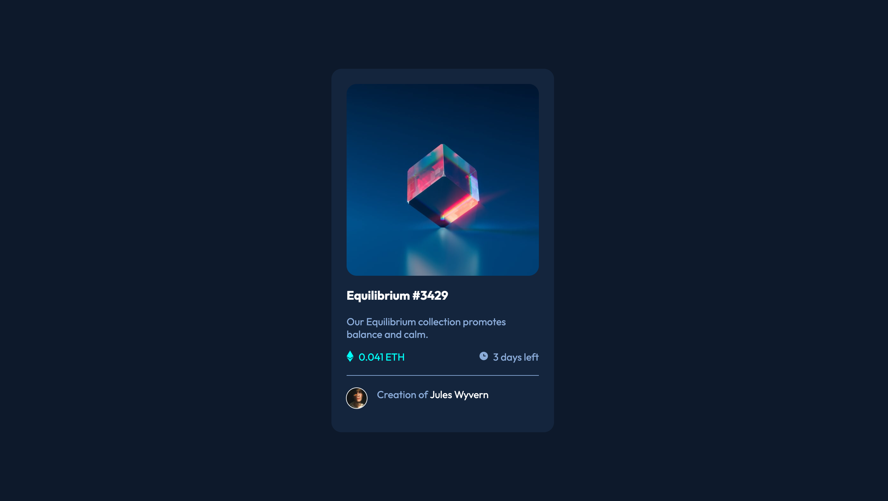

# Frontend Mentor - NFT Preview Card Challenge
## Overview
This repository is an attempt to recreate the [NFT Preview Card design on Frontend Mentor](https://www.frontendmentor.io/challenges/nft-preview-card-component-SbdUL_w0U).  The challenge is classified as a beginner level project, as it focuses on just HTML and CSS.  However, it does introduce a few CSS behaviours that are challenging, particularly causing an image to swap to another image on hover.
## Built With
* HTML
* CSS
## Challenges
In some ways, the design of this project was easier than any of the previous challenges, maintaining the same layout in web and mobile designs.  However, as mentioned above, it introduces a few more advanced uses of the :hover pseudo-class.  I had to look at a few websites to learn how to solve this part of the system, and the hover image was not available in the original .zip file that was provided.  I had to extract it from the Figma file.
## Finished Project
The repository for this site is found on [Github](https://github.com/Grimmaldi/fe-mentor-nft-preview-card), while the live webpage can be found [here as a Github Page](https://grimmaldi.github.io/fe-mentor-nft-preview-card/).  To see a static image of the site, please see the screenshot below:
